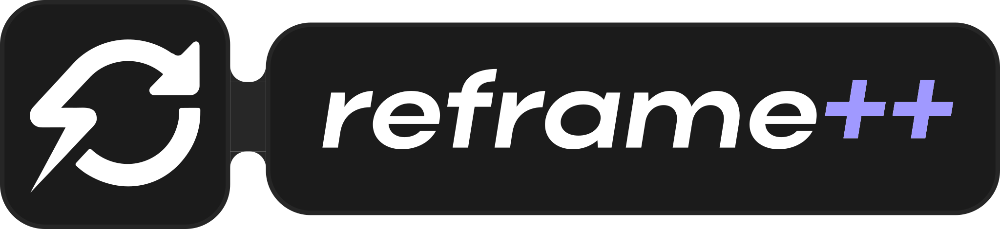

<p align="center">
  
</p>

<p align="center">
  <b>Запись экрана и мгновенные повторы для Windows.</b><br>
  Накладные расходы уровня ShadowPlay — без привязки к вендору и без его застарелых багов.
</p>

<p align="center">
  
  
  
</p>

---

## Что это

reframe++ пишет игру или рабочий стол в фоне и позволяет сохранить последние
секунды одной клавишей — уже после того, как момент случился. Кадры не покидают
видеопамять: захват, преобразование цвета и кодирование целиком идут на GPU,
поэтому запись почти не отнимает кадры у игры.

Область намеренно узкая: **запись видео и мгновенные повторы**. Ни стриминга, ни
фоторежима, ни списка игр.

## Возможности

**Захват**

- **Игровой захват** — DLL внедряется в игру и берёт кадры из её собственного
  `Present`. Частота записи не ограничена монитором: 144 fps пишутся как 144
  даже на панели 75 Гц.
- **Захват дисплея** через DXGI Desktop Duplication — полная частота обновления,
  без потерь на композитор.
- **Захват окна** через Windows.Graphics.Capture — запасной путь для всего, что
  не отдаёт swapchain.

Нужный способ выбирается сам. Тумблер «Запись рабочего стола» решает, писать
экран целиком или приложение на переднем плане; при отказе внедрения захват
молча откатывается на оконный.

**Кодирование**

- Прямой **NVENC** через `nvEncodeAPI` — асинхронный режим, восемь кадров в
  работе, один проход.
- Прямой **AMF** на видеокартах AMD.
- **Media Foundation** как запасной кодировщик — через него работают Intel QSV, а
  также NVIDIA и AMD, когда прямой путь недоступен. Если аппаратного кодировщика
  нет вовсе, запись идёт программным кодировщиком Windows.
- Преобразование BGRA → NV12 на `ID3D11VideoProcessor`: фиксированный блок GPU,
  не шейдерные ядра, поэтому оно не конкурирует с игрой за вычисления.
- H.264 и HEVC, битрейтные пресеты 10 / 15 / 20 Мбит/с и ручной ползунок до 30.

**Повторы**

Кольцевой буфер живёт на диске сегментами по 32 МБ, а не в оперативной памяти —
час записи не превращается в гигабайты RSS. Обрезка выравнена по GOP, поэтому
сохранённый файл всегда начинается с ключевого кадра и открывается где угодно.
Сохранение мгновенное: пакеты уже закодированы, остаётся только смуксить.

**Звук**

Системный звук (WASAPI loopback) и микрофон сводятся с раздельной громкостью и
кодируются в AAC 192 кбит/с. Тишина заполняется явно, чтобы дорожки не расходились.

**Интерфейс**

Оверлей на Dear ImGui поверх DirectComposition — прозрачное окно без
перерисовочного слоя, поэтому меню не мешает игре и не отнимает кадры. Галерея с
превью, встроенный плеер, HUD с тостами и пилюлей записи, настраиваемые
горячие клавиши.

## Горячие клавиши

| Действие | По умолчанию |
|---|---|
| Открыть меню | `ALT` + `Z` |
| Начать / остановить запись | `ALT` + `F9` |
| Сохранить повтор | `ALT` + `F10` |

Эти сочетания занимает GeForce Experience, поэтому при отказе регистрации
приложение само переходит на `CTRL`+`ALT`+… и показывает в интерфейсе то, что
реально сработало, а не то, что было задумано. Любую комбинацию можно
переназначить в разделе «Горячие клавиши».

## SDK для разработчиков

Игра, программа или мод могут сами сохранять моменты через reframe++ — например,
автоматический откат при каждом убийстве. Клип из игры содержит только её кадры и
её звук, а обычный откат по `ALT` + `F10` при этом работает как раньше.

Связь идёт напрямую через локальный named pipe, без HTTP и вебхуков. Если
reframe++ не запущен, вызовы SDK молча ничего не делают и не тормозят игру.

SDK есть для **C**, **C++**, **C#** (в том числе Unity), **Java** (в том числе моды
Minecraft) и **Python**. Код, протокол и документация — в отдельном открытом
репозитории под лицензией MIT:
[shadowyohan/reframe-plus-plus-sdk](https://github.com/shadowyohan/reframe-plus-plus-sdk).

## Установка

Готовый установщик собирается из исходников (см. ниже) и кладёт рядом с
`Reframe.exe` файл `reframe-hook64.dll` — он обязан лежать в той же папке, иначе
игровой захват работать не будет.

## Сборка

Нужны Visual Studio 2022 с рабочей нагрузкой **Разработка классических
приложений на C++** и Windows SDK не ниже 10.0.20348.

```bash
cmake --preset vs2022
cmake --build --preset vs2022
```

Результат — в `build/vs2022/bin`. Открыть решение в IDE можно по пути
`build/vs2022/ReframePlusPlus.sln`.

Вендорские SDK для сборки не нужны: заголовки NVENC и AMF вложены в репозиторий.
Если нужна другая версия AMF, укажите путь к ней:

```bash
cmake --preset vs2022 -DRF_AMF_SDK_DIR=C:/sdk/AMF
```

Установщик (нужен [Inno Setup 6](https://jrsoftware.org/isinfo.php)):

```bash
cmake --build --preset vs2022 --target installer
```

Тесты:

```bash
ctest --preset vs2022
```

## Требования

- Windows 10 версии 1809 или новее, только x64
- Видеокарта с D3D11 и аппаратным кодировщиком H.264
- Для игрового захвата — 64-битная игра на D3D11

> **Какие видеокарты подходят**
>
> Аппаратный кодировщик есть у NVIDIA начиная с Kepler, у AMD начиная с GCN и у
> Intel начиная с Sandy Bridge. Полные таблицы по поколениям, список карт без
> кодировщика и что происходит на них — в
> [GPU-SUPPORT.md](GPU-SUPPORT.md).
>
> Проверить свою машину: запустить `reframe-cli.exe` и посмотреть раздел
> `Hardware encoders:`.

## Что стоит знать

Часть ограничений принципиальна, и лучше узнать о них здесь, а не в бою:

- **Игровой захват работает только с 64-битными приложениями на D3D11.** D3D12,
  Vulkan, OpenGL и 32-битные процессы требуют отдельных хуков; они чисто
  откатываются на оконный захват, но тогда потолок частоты — герцовка монитора.
- **Античит может блокировать внедрение.** Именно поэтому игровой захват
  включается явно и никогда не выбирается автоматическим режимом.
- **Некоторым играм нужен запуск от администратора**, иначе `OpenProcess` не
  получит доступ к процессу.
- **Windows Defender может ругаться на инжектор** — это неотделимо от того, что
  он делает.
- **Ограничение места на диске пока не применяется**: тумблер и ползунок
  сохраняются, но старые записи автоматически не удаляются.

## Где что лежит

```
src/rf/capture/    захват: duplication, WGC, игровой хук и его протокол
src/rf/encode/     кодировщики: NVENC, Media Foundation, AMF
src/rf/gpu/        устройство D3D11, преобразование цвета, обмен кадрами между картами
src/rf/replay/     кольцевой буфер повторов на диске
src/rf/player/     встроенный плеер на IMFMediaEngine
src/rf/ui/         оверлей, экраны, HUD, виджеты
apps/shell/        приложение с треем и горячими клавишами
apps/cli/          диагностическая утилита
third_party/       Dear ImGui, nanosvg, MinHook, заголовки NVENC
```

Настройки и журналы — в `%LOCALAPPDATA%\Reframe`, записи по умолчанию —
в `%USERPROFILE%\Videos\Reframe`.
## Лицензия

© 2026 shadowyohan. Все права защищены.

Исходный код открыт для ознакомления, но это не открытая лицензия:
распространение, коммерческое использование и производные работы требуют
письменного разрешения. Собрать программу из исходников и пользоваться ей лично
можно свободно. Полные условия — в [LICENSE](LICENSE).

Вложенные компоненты — Dear ImGui, MinHook, nanosvg и заголовки NVENC —
распространяются на собственных условиях; их тексты собраны в
[THIRD-PARTY-NOTICES.md](THIRD-PARTY-NOTICES.md)
