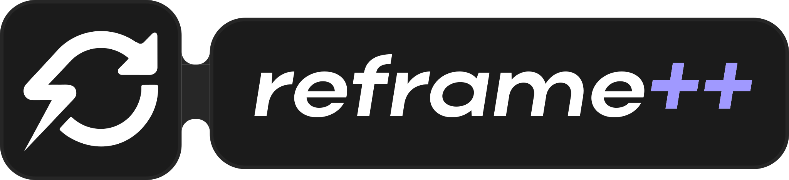

<p align="center">
  
</p>

<p align="center">
  <b>Запись экрана и мгновенные повторы для Windows.</b><br>
  Накладные расходы уровня ShadowPlay — без привязки к вендору и без его застарелых багов.
</p>

<p align="center">
  
  
  
</p>

---

## Что это

reframe++ пишет игру или рабочий стол в фоне и позволяет сохранить последние
секунды одной клавишей — уже после того, как момент случился. Кадры не покидают
видеопамять: захват, преобразование цвета и кодирование целиком идут на GPU,
поэтому запись почти не отнимает кадры у игры.

Область намеренно узкая: **запись видео, мгновенные повторы и быстрый монтаж
клипа**. Ни стриминга, ни фоторежима.

## ❤️ Поддержите проект

Поддержите проект на [Boosty](https://boosty.to/reframepp) 🧡 — это сильно поможет
дальнейшей разработке. Также вы получаете некоторые плюшки. Подробнее — на нашем
Boosty.

Ещё можно поддержать через криптовалюту:
[счёт оплаты xRocket](https://t.me/xrocket?start=inv_EvdmyKuqgM7JMdk) (USDT, можно
напрямую по адресу блокчейна).

## Возможности

**Захват**

- **Игровой захват** — DLL внедряется в игру и берёт кадры из её собственного
  `Present` (D3D11) или `SwapBuffers` (OpenGL). Частота записи не ограничена
  монитором: 144 fps пишутся как 144 даже на панели 75 Гц.
- **Захват дисплея** через DXGI Desktop Duplication — полная частота обновления,
  без потерь на композитор. Можно следовать за курсором между мониторами.
- **Захват окна** через Windows.Graphics.Capture — запасной путь для всего, что
  не отдаёт swapchain.

Нужный способ выбирается сам. Тумблер «Запись рабочего стола» решает, писать
экран целиком или приложение на переднем плане; если внедрение не удалось,
захват молча откатывается на оконный.

**Кодирование**

- Прямой **NVENC** через `nvEncodeAPI` — асинхронный режим, глубина очереди
  подбирается под объём видеопамяти, один проход.
- Прямой **AMF** на видеокартах AMD.
- **Media Foundation** как запасной кодировщик — через него работают Intel QSV, а
  также NVIDIA и AMD, когда прямой путь недоступен.
- Кодеки **H.264**, **H.265** и **AV1** — в настройках видны только те, что умеет
  ваша видеокарта. AV1 есть у RTX 40, RX 7000 и Intel Arc.
- Преобразование и масштабирование на `ID3D11VideoProcessor`: фиксированный блок
  GPU, не шейдерные ядра, поэтому оно не конкурирует с игрой за вычисления.
- Пресеты 10 / 15 / 20 Мбит/с и ручной ползунок до 30, разрешение до 4K,
  30–144 fps, принудительное соотношение сторон 16:9 / 16:10 / 4:3 / 21:9 —
  растянуть картинку или оставить полосы.

**Повторы**

Кольцевой буфер хранится сегментами по 32 МБ — на диске или, по выбору, в
оперативной памяти. Обрезка выравнена по GOP, поэтому сохранённый файл всегда
начинается с ключевого кадра и открывается где угодно. Сохранение мгновенное:
пакеты уже закодированы, остаётся только смуксить. Если больше 60% повтора на
экране было одно приложение, клип называется по нему.

**Звук**

- Системный звук (WASAPI loopback) и микрофон с раздельной громкостью, AAC 192 кбит/с.
- Три формата дорожек: всё на одной; общая + система + микрофон отдельно; общая,
  микрофон и **каждое приложение на своей дорожке**. Первая дорожка всегда общая,
  поэтому Telegram, Discord и обычные плееры слышат клип целиком.
- У дорожек есть названия, пустые дорожки в файл не попадают.
- Шумоподавление микрофона: RNNoise, Speex или NVIDIA Maxine (RTX).
- Захват сам переживает смену наушников, сон и перезапуск аудиодрайвера, а
  тишина досыпается явно, чтобы звук не расходился с картинкой.

**Галерея и редактор**

- Галерея с превью, избранным и фильтром по приложениям.
- Встроенный плеер с метками моментов на таймлайне.
- **Редактор клипа**: обрезка, громкость каждой дорожки от 0 до 200%, удаление
  дорожек с живым превью звука. Сохранение поверх исходника или копией; если
  менялся только звук, видео копируется без перекодирования.

**Интерфейс**

Оверлей на Dear ImGui поверх DirectComposition — прозрачное окно без
перерисовочного слоя, поэтому меню не мешает игре и не отнимает кадры. Меню
открывается на мониторе с активным окном и масштабируется целиком, как страница в
браузере. HUD с уведомлениями, индикатором записи и значками — их можно поставить
в любой угол или перетащить мышью куда угодно. Интерфейс на русском и английском.

**Обновления**

reframe++ раз в 10 минут проверяет релизы на GitHub. По кнопке «Скачать» в
уведомлении установщик скачивается, сверяется по SHA-256 с релизом и запускается.

## Горячие клавиши

| Действие | По умолчанию |
|---|---|
| Открыть меню | `ALT` + `Z` |
| Начать / остановить запись | `ALT` + `F9` |
| Сохранить повтор | `ALT` + `F10` |
| Включить / выключить повторы | `ALT` + `SHIFT` + `F10` |

Часть этих сочетаний занимают GeForce Experience и ShadowPlay, поэтому при
отказе регистрации приложение само переходит на `CTRL`+`ALT`+… и показывает в
интерфейсе то, что реально сработало, а не то, что было задумано. Любую
комбинацию можно переназначить в разделе «Горячие клавиши».

## Авто-откаты и SDK для разработчиков

Игра, программа или мод могут сами сохранять моменты через reframe++ — например,
клип при каждом убийстве. Клип из игры содержит только её окно и её звук, а
события (`kill`, `triple`…) видны флажками на таймлайне, в главах файла и в
маркерах Premiere / After Effects. Обычный повтор по `ALT` + `F10` при этом
работает как раньше. Разрешить или запретить авто-откаты, обрезку кадра и звук
только из приложения можно в разделе «Авто-откаты».

Связь идёт напрямую через локальный named pipe, без HTTP и вебхуков. Если
reframe++ не запущен, вызовы SDK молча ничего не делают и не тормозят игру.

SDK есть для **C**, **C++**, **C#** (в том числе Unity), **Java** (в том числе моды
Minecraft) и **Python**. Код, протокол, документация и готовый мод для Minecraft —
в отдельном открытом репозитории под лицензией MIT:
[shadowyohan/reframe-plus-plus-sdk](https://github.com/shadowyohan/reframe-plus-plus-sdk).

## Установка

Установщик и сборка без установщика — в
[Releases](https://github.com/shadowyohan/reframe-plus-plus/releases).

В сборке без установщика `reframe-hook64.dll` должна лежать в той же папке, что и
`Reframe.exe`, иначе игровой захват работать не будет. Установщик кладёт её сам и
создаёт задачу планировщика, через которую программа запускается с повышенным
приоритетом без окна UAC при каждом старте.

## Сборка

Нужны Visual Studio 2022 с рабочей нагрузкой **Разработка классических
приложений на C++** и Windows SDK не ниже 10.0.20348.

```bash
cmake --preset vs2022
cmake --build --preset vs2022
```

Результат — в `build/vs2022/bin`. Открыть решение в IDE можно по пути
`build/vs2022/ReframePlusPlus.sln`.

Вендорские SDK для сборки не нужны: заголовки NVENC и AMF вложены в репозиторий.
Если нужна другая версия AMF, укажите путь к ней:

```bash
cmake --preset vs2022 -DRF_AMF_SDK_DIR=C:/sdk/AMF
```

Установщик (нужен [Inno Setup 6](https://jrsoftware.org/isinfo.php)):

```bash
cmake --build --preset vs2022 --target installer
```

Тесты:

```bash
ctest --preset vs2022
```

## Требования

- Windows 10 версии 1809 или новее, только x64; для дорожек по приложениям — 2004 или новее
- Видеокарта с D3D11 и аппаратным кодировщиком H.264
- Для игрового захвата — 64-битная игра на D3D11 или OpenGL

> **Какие видеокарты подходят**
>
> Аппаратный кодировщик есть у NVIDIA начиная с Kepler, у AMD начиная с GCN и у
> Intel начиная с Sandy Bridge. Полные таблицы по поколениям, список карт без
> кодировщика и что происходит на них — в
> [GPU-SUPPORT.md](GPU-SUPPORT.md).
>
> Проверить свою машину: запустить `reframe-cli.exe` и посмотреть раздел
> `Hardware encoders:`.

## Что стоит знать

Часть ограничений принципиальна, и лучше узнать о них здесь, а не в бою:

- **Игровой захват работает только с 64-битными играми на D3D11 и OpenGL.**
  D3D12, Vulkan и 32-битные процессы требуют отдельных хуков; они чисто
  откатываются на оконный захват, но тогда потолок частоты — герцовка монитора.
- **Античит может блокировать внедрение.** Тогда запись идёт оконным захватом.
- **Некоторым играм нужен запуск от администратора**, иначе `OpenProcess` не
  получит доступ к процессу.
- **Windows Defender может ругаться на инжектор** — это неотделимо от того, что
  он делает.
- **Для H.265 и AV1 Windows нужны расширения** «HEVC Video Extensions» и
  «AV1 Video Extension» из Microsoft Store, иначе такие клипы не откроются во
  встроенном плеере. Не все редакторы и мессенджеры открывают эти кодеки.
- **Лимит места ничего не удаляет сам**: когда папка с записями заполнена,
  повторы и запись просто перестают сохраняться до очистки.

## Где что лежит

```
src/rf/capture/       захват: duplication, WGC, игровой хук и его протокол
src/rf/encode/        кодировщики: NVENC, AMF, Media Foundation
src/rf/gpu/           устройство D3D11, преобразование цвета, обмен кадрами между картами
src/rf/audio/         захват звука, дорожки приложений, AAC, шумоподавление
src/rf/replay/        кольцевой буфер повторов
src/rf/mux/           MP4, названия дорожек, метки, обрезка и сохранение из редактора
src/rf/engine/        запись, настройки, проверка обновлений
src/rf/gallery/       список клипов, превью, избранное
src/rf/integrations/  авто-откаты: named pipe и протокол SDK
src/rf/player/        встроенный плеер и микшер дорожек редактора
src/rf/ui/            оверлей, экраны, редактор, HUD, виджеты
apps/shell/           приложение с треем и горячими клавишами
apps/cli/             диагностическая утилита
third_party/          Dear ImGui, nanosvg, MinHook, RNNoise, SpeexDSP, заголовки NVENC и AMF
```

Настройки и журналы — в `%LOCALAPPDATA%\Reframe`, записи по умолчанию —
в `%USERPROFILE%\Videos\Reframe`.

## Лицензия

© 2026 shadowyohan. Все права защищены.

Исходный код открыт для ознакомления, но это не открытая лицензия:
распространение, коммерческое использование и производные работы требуют
письменного разрешения. Собрать программу из исходников и пользоваться ей лично
можно свободно. Полные условия — в [LICENSE](LICENSE).

Вложенные компоненты — Dear ImGui, MinHook, nanosvg, RNNoise, SpeexDSP и
заголовки NVENC и AMF — распространяются на собственных условиях; их тексты
собраны в [THIRD-PARTY-NOTICES.md](THIRD-PARTY-NOTICES.md).
